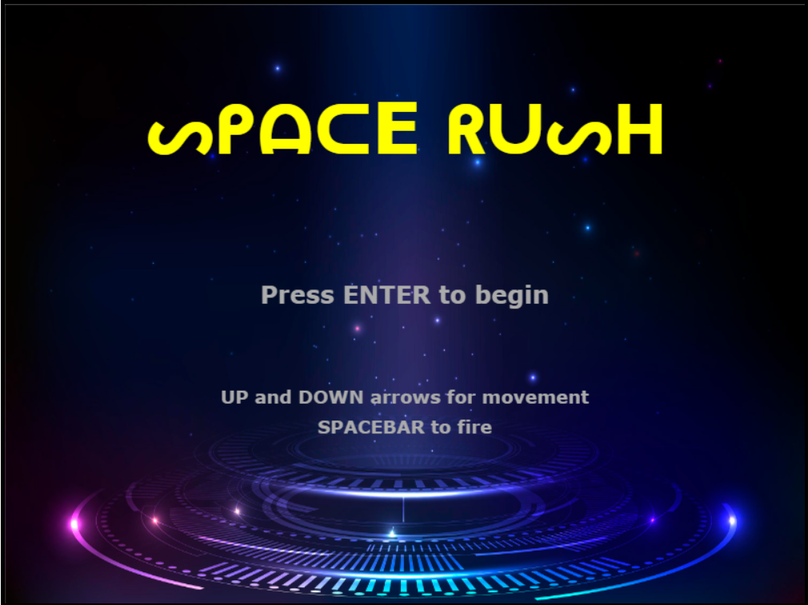
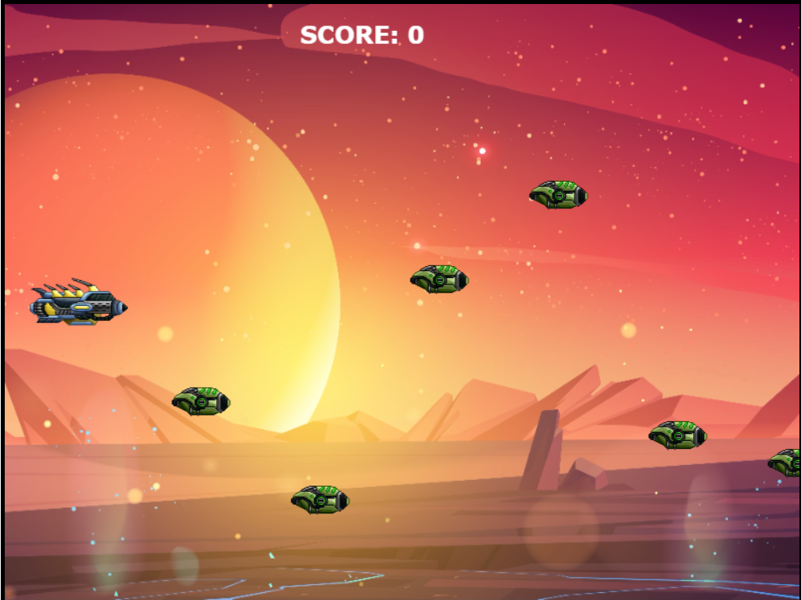

# SpaceRush
A simple 2D game made with vanilla javascript. 
No frameworks have been used apart from Canvas  
Live demo at CodeSandbox [here](https://sdh7c.csb.app/)

NOTE: This is not a tile based game. The movements are continous.
Game physics for bullet collsion have been used accordingly.\
 \

